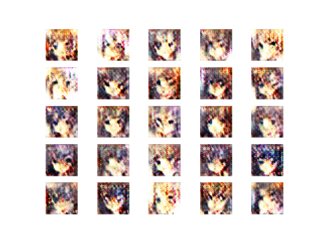
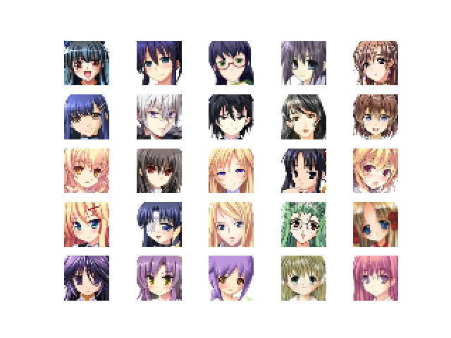

**DCGAN**

*Generated faces after 10 epochs*\

*vs real images from dataset*\

*Reference*
1. GAN — GAN Series (from the beginning to the end) [Link](https://jonathan-hui.medium.com/gan-gan-series-2d279f906e7b)
2. DCGAN to generate face images [Link](https://keras.io/examples/generative/dcgan_overriding_train_step/)